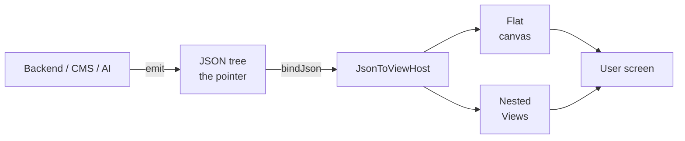
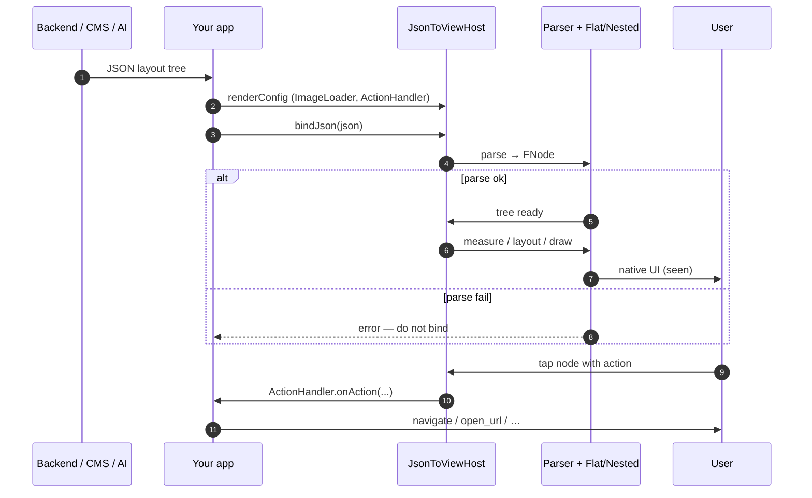
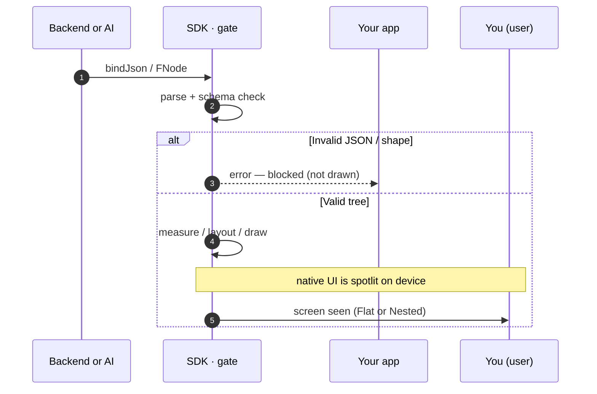
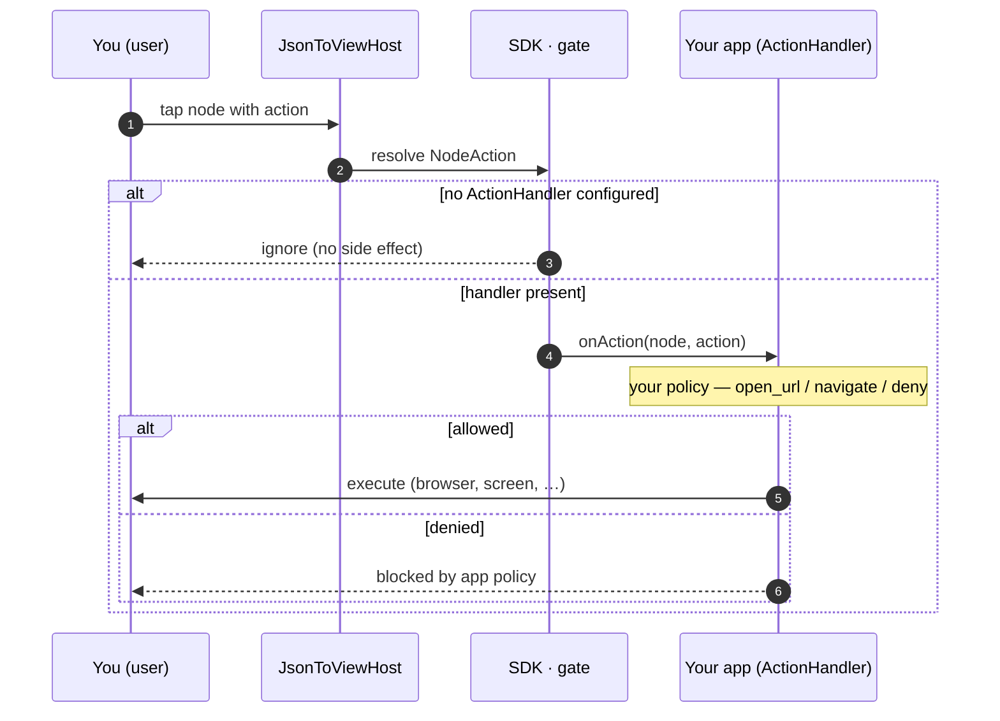
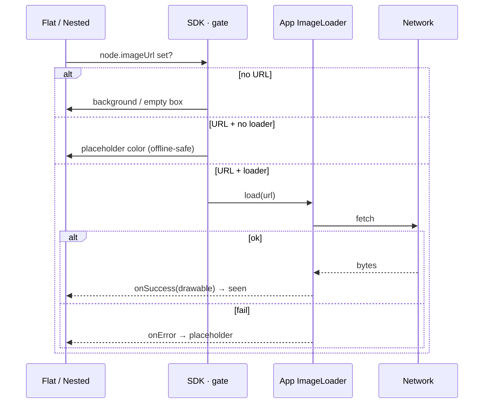
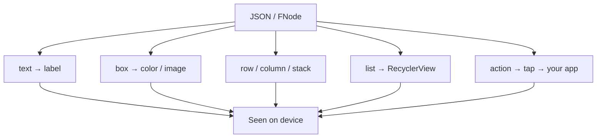

# json-to-view

<p align="center">
  <strong>Drop a JSON tree on the client — the app builds the screen the user sees, natively.</strong><br/>
  One model. Two renderers. Measure cost. Optional AI studio in the sample app only.
</p>

<p align="center">
  <em>same&nbsp;FNode · Flat&nbsp;(canvas)&nbsp;/&nbsp;Nested&nbsp;(Views) · offline&nbsp;core · app-owned&nbsp;images&nbsp;&amp;&nbsp;actions</em>
</p>

<p align="center">
  <a href="LICENSE"></a>
  
  
  
  
  
  
</p>

<p align="center">
  <a href="https://github.com/manhtu227/FView/actions/workflows/ci.yml"></a>
  <a href="https://github.com/manhtu227/FView/releases"></a>
  
</p>

<p align="center">
  <a href="#the-pointer">The pointer</a> ·
  <a href="#-how-it-works">How it works</a> ·
  <a href="#-packages">Packages</a> ·
  <a href="#️-configuration">Configuration</a> ·
  <a href="#-the-gate-seen">The gate, seen</a> ·
  <a href="#-seen">Seen</a> ·
  <a href="#-how-it-compares">Compare</a> ·
  <a href="#-faq">FAQ</a>
</p>

> **Note**  
> Public SDK API is frozen for **v1.x** — see [docs/api-1.0.md](docs/api-1.0.md).  
> AI Layout Studio lives in the **sample app only** (not the published AAR). Feedback welcome.

---

## The pointer

In this project the **pointer** is the **declarative UI tree** the backend (or AI, or Kotlin code) hands the client:

| Layer | What it is |
|-------|------------|
| **JSON** | What backend / CMS / AI emits (`type`, `props`, `children`) |
| **`FNode`** | In-memory tree after parse |
| **`JsonToViewHost`** | Single widget that “hosts” that tree and draws it |

You do **not** drop Android Views from the server. You drop a **description**. The host moves in and builds what the user sees — **natively** (Flat canvas or Nested Views).



Stable mapping: [docs/MAPPING_STABLE.md](docs/MAPPING_STABLE.md) · full schema: [docs/schema.md](docs/schema.md)

---

## 🧭 How it works

1. **Describe** — backend (or sample AI Studio) produces JSON or you build `FNode` in Kotlin.  
2. **Parse** — `JsonTreeParser` / `JsonToView.parse` → `FNode`.  
3. **Configure** — optional `RenderConfig` (image loader + action handler from **your app**).  
4. **Render** — `JsonToViewHost` with `Mode.FLAT` or `Mode.NESTED`.  
5. **Measure** (optional) — `BenchmarkRunner` compares cost on the **same** tree.



```kotlin
val host = JsonToViewHost(context).apply {
    mode = JsonToViewHost.Mode.FLAT
    renderConfig = RenderConfig(
        imageLoader = MyImageLoader(context),      // app provides
        actionHandler = { node, action -> /* navigate */ },
    )
    bindJson(backendJson)
}
container.addView(host, MATCH_PARENT, MATCH_PARENT)
```

| Mode | Best for |
|------|----------|
| **FLAT** | Performance — few Android `View`s, canvas draw |
| **NESTED** | Debug / inspection — real `View` hierarchy |

---

## 📦 Packages

| Package / module | Role |
|------------------|------|
| **`com.manhtu.jsontoview`** | `JsonToViewHost`, `JsonToView`, `RenderConfig` |
| **`.model`** | `FNode`, `NodeProps`, `NodeAction`, `Dimension`, … |
| **`.parse`** | `JsonTreeParser` |
| **`.flat`** | `FlatHostView` |
| **`.nested`** | `NestedHost`, `NestedTreeBuilder` |
| **`.image` / `.action`** | `ImageLoader`, `NodeActionHandler` (contracts only) |
| **`.benchmark`** | `BenchmarkRunner`, reports (tooling) |
| **`:json-to-view`** | Publishable AAR |
| **`:app`** | Sample (feed, samples, AI Studio, benchmark) — not published |
| **`:consumer-demo`** | Second app using the library as a consumer |

Install (JitPack):

```kotlin
// settings.gradle.kts
maven { url = uri("https://jitpack.io") }

// app/build.gradle.kts
implementation("com.github.manhtu227.FView:json-to-view:v1.0.0")
```

Monorepo: `implementation(project(":json-to-view"))`  
Local: `./gradlew :json-to-view:publishToMavenLocal` → `io.github.manhtu227:json-to-view:1.0.0`

---

## ⚙️ Configuration

### Host

| Setting | Meaning |
|---------|---------|
| `mode` | `FLAT` or `NESTED` |
| `bind` / `bindJson` / `clear` | Attach or detach the tree |
| `renderConfig` | Images + taps (see below) |

### `RenderConfig` (app-owned)

```kotlin
RenderConfig(
    imageLoader = …,              // null → solid placeholder (bench-safe)
    actionHandler = …,            // null → taps ignored
    imagePlaceholderColor = 0xFF888888.toInt(),
)
```

| Concern | Where it lives |
|---------|----------------|
| Network images (Glide/Coil) | **Your app** implements `ImageLoader` |
| Navigation / analytics on tap | **Your app** implements `NodeActionHandler` |
| Layout measure/draw | **SDK** |
| AI API keys | **Sample / your server only** — never in the AAR |

### Sample AI Studio (optional)

| Key | Where |
|-----|--------|
| `AI_API_KEY` | `local.properties` (debug only, gitignored) |
| `AI_BASE_URL` / `AI_MODEL` | BuildConfig defaults (OpenAI-compatible) |

See [docs/ai-studio.md](docs/ai-studio.md). CLI: `python3 scripts/ai_layout.py "…" -o out.json`

---

## 🚦 The gate, seen

Remote or AI-generated UI makes **governance more necessary, not less**.  
Nothing untrusted reaches the screen until it passes the **gate** — parse, schema, and app-owned image/action hooks. The **security boundary is the gate**, not the prompt.

### Bind path (JSON → screen)



### Action path (tap → your policy)

When a node carries `action`, the SDK does **not** navigate by itself. It **spotlights** the intent and hands control to **your** handler — you approve what happens next.



### Image path (URL → pixels)



| Gate | What happens |
|------|----------------|
| **Parse** | Invalid JSON / shape → **fail before bind** |
| **Schema** | Stable `type` + props; unknown fields ignored |
| **Images** | Core never fetches; **your** `ImageLoader` owns network |
| **Actions** | Core never navigates; **your** `NodeActionHandler` owns side effects |
| **AI (sample)** | Model output must parse; bad JSON is not bound |
| **Benchmark** | Empty `RenderConfig` — no network, deterministic cost |

Public surface: [docs/api-1.0.md](docs/api-1.0.md).

---

## 👁 Seen

What the **user** actually sees is always **native Android UI**, not a WebView:



| Source | What appears on device |
|--------|-------------------------|
| `text` | Text (Flat canvas / Nested `TextView`) |
| `box` + color | Colored rect |
| `box` + `imageUrl` | Image via **your** loader, or gray placeholder |
| `row` / `column` / `stack` | Layout structure |
| `list` | Vertical `RecyclerView` of item subtrees |
| `action` | Tap → your handler (toast/navigate/…) |

**Same JSON** → switch Flat ↔ Nested → same content, different hierarchy cost.

**See it running:**

```bash
./gradlew :app:installDebug
adb shell am start -n com.demo.jsontoview/.demo.LauncherActivity
```

| Screen | What you see |
|--------|----------------|
| Feed / samples | Real JSON trees on screen |
| AI Layout Studio | Prompt → generated UI |
| Benchmark | Numbers: measure, layout, first frame, viewCount, … |

Samples: [docs/schema/](docs/schema/) · demo notes: [docs/demo.md](docs/demo.md)

---

## 🆚 How it compares

| | **Hardcoded XML / Compose** | **Classic SDUI**<br/>(1 node → 1 View) | **WebView remote UI** | **json-to-view** |
|--|----------------------------|----------------------------------------|------------------------|------------------|
| **UI lives** | in the app binary | in app Views, driven by JSON | in HTML/JS | in app (native Flat or Nested) |
| **Layout comes from** | ship a new app build | backend JSON | backend HTML/URL | backend JSON (or AI → JSON) |
| **What the model holds** | Kotlin/Compose code | usually full View tree | DOM | one `FNode` tree, two draw paths |
| **Deep hierarchy cost** | you design it once | often expensive by default | browser engine cost | **Flat** can cut `View` count; **Nested** matches classic |
| **Change layout without store release** | no | yes | yes | yes |
| **Native look / a11y** | full native | full native | web-ish | full native |
| **Images / navigation** | your code | often baked into SDK or Views | web | **your** `ImageLoader` + `ActionHandler` |
| **Fair Flat vs Nested metrics** | n/a | n/a | n/a | built-in `BenchmarkRunner` |
| **AI in the product surface** | optional elsewhere | rare | optional | **sample Studio only** — not inside the AAR |
| **Runtime / cloud** | your app | your app + backend | WebView + network | your app + backend; core **offline** |

<p align="center"><em>Same tree the user would get from the server — measured twice, drawn natively, not like a full browser or a forced 1:1 View map.</em></p>

### When to pick what

| You need… | Prefer |
|-----------|--------|
| Static, highly polished product UI | Compose / XML |
| Remote layout, always real Views | Classic SDUI or **Nested** mode |
| Remote layout + fewer Views on deep feeds | **Flat** mode |
| Remote HTML already exists | WebView |
| Remote layout **and** cost numbers on the same tree | **json-to-view** (Both in Benchmark) |

---


## ❓ FAQ

**Is the backend building Android Views?**  
No. Backend (or AI) builds a **description**. The app builds Views/canvas.

**Do I need AI?**  
No. AI Studio is optional sample tooling. Production path is JSON from your backend.

**Where does the API key go?**  
Not in the published SDK. Sample: `AI_API_KEY` in gitignored `local.properties` (debug only). Production: server proxy.

**Flat or Nested?**  
Flat for hot paths / deep trees; Nested when you want Layout Inspector and classic hierarchy. You can switch without changing JSON.

**Images / Glide in the library?**  
No. Implement `ImageLoader` in the app (sample uses Glide).

**Can I use only Kotlin, no JSON?**  
Yes — build `FNode` trees and `host.bind(root)`.

**Is the API stable?**  
v1.x public API is documented and frozen for breaking changes — [docs/api-1.0.md](docs/api-1.0.md).

**How do I measure cost?**  
Sample **Benchmark** screen, or `BenchmarkRunner` in your app. Prefer empty `RenderConfig` for deterministic runs.

**Maven Central?**  
JitPack / `mavenLocal` today; Central steps in [docs/publishing.md](docs/publishing.md).

---

## Quick start (copy-paste)

```kotlin
implementation("com.github.manhtu227.FView:json-to-view:v1.0.0")
// + maven { url = uri("https://jitpack.io") }
```

```kotlin
import com.manhtu.jsontoview.JsonToViewHost

val host = JsonToViewHost(context).apply {
    mode = JsonToViewHost.Mode.FLAT
    bindJson(jsonFromBackend)
}
```

More: [docs/schema.md](docs/schema.md) · [docs/feed-templates.md](docs/feed-templates.md) · [CHANGELOG.md](CHANGELOG.md)

---

## Contributing & license

```bash
./gradlew :json-to-view:testDebugUnitTest :app:assembleDebug
```

- [CONTRIBUTING.md](CONTRIBUTING.md) · [SECURITY.md](SECURITY.md)  
- Apache License 2.0 — [LICENSE](LICENSE)  
- Maintainer: [manhtu227](https://github.com/manhtu227)
